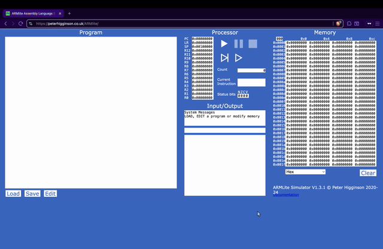

# ARMLite Sprite Converter v1

This directory contains `converter.py`, a CLI tool for turning any 128×96 image into ARM assembly that renders a fullscreen sprite inside Peter Higginson's [ARMLite Simulator](https://peterhigginson.co.uk/ARMlite/). The script maps every pixel to one of ARMLite's predefined color names and emits the `.Resolution`, `.PixelScreen`, and per-pixel store instructions expected by the simulator.

## Preview



## Requirements
- Python 3.10+ (system install, [pyenv](https://github.com/pyenv/pyenv), or [conda](https://docs.conda.io/en/latest/))
- [`Pillow`](https://python-pillow.org) and [`webcolors`](https://pypi.org/project/webcolors/) installed inside an isolated environment

### Recommended environment setup
Create a virtual environment with whichever workflow you prefer before installing dependencies:

```bash
# stdlib venv
python3 -m venv .venv
source .venv/bin/activate

# or: pyenv virtualenv <version> armlite-v1 && pyenv activate armlite-v1
# or: conda create -n armlite-v1 python=3.10 && conda activate armlite-v1

pip install pillow webcolors
```

<div style="border-radius:12px;border:1px solid #061c35;padding:0.85rem 1rem;margin:1rem 0;background: #011f17ff;color: #ffffffff;">
   <strong>Quick-start:</strong> activate your venv → run <code>python3 converter.py your-image.png -o sprite.s</code> → upload to ARMLite → hit <em>Run</em>.
</div>

## Usage
1. Place your source image (any format Pillow supports) in this directory or provide a path to it.
2. Run the converter:
   ```bash
   python3 converter.py path/to/image.png -o converted.s 
   ```
   The script automatically resizes the image to 128×96, quantizes it to the ARMLite palette, and writes the resulting assembly to `converted.s` (or any file you specify).
3. Open the ARMLite Simulator at https://peterhigginson.co.uk/ARMlite/.
4. Paste or upload the generated `.s` file into the simulator editor.
5. Assemble and run to display your sprite on the virtual PixelScreen.

## Notes
- The converter writes straightforward ARM assembly—feel free to inspect or adapt the output before uploading to ARMLite.
- It's not strictly necessary to use a Source Code file (the *.s extension), any text based file extension should work. Though, you may see some indentation issues.

